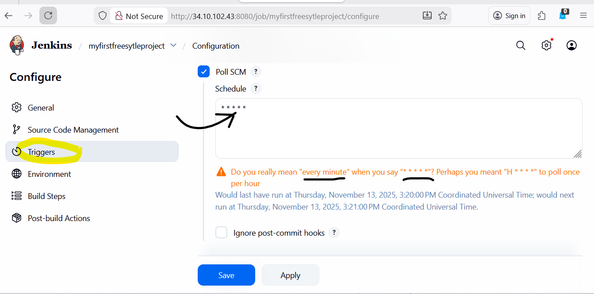

Date-10/11/2025 -Mon
### Jenkins
* Jenkins User Management
- Goto Manage jenkins>users

# CI - Continuos Integration
- when developer develops code in local and pushes his commits and code automatically 
starts compile,tests and build and create an artifact for deployment ,this process is 
known as CI.
- CI is used to automate the build process.
- 
- 
- 

- Configure Poll SCM 
- * * * * * [ run every minute]

